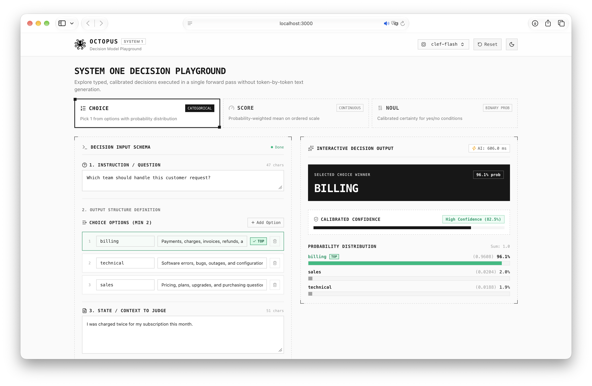

<div align="center">

<picture>
  <source media="(prefers-color-scheme: dark)" srcset="./frontend/static/logo-dark.svg">
  <source media="(prefers-color-scheme: light)" srcset="./frontend/static/logo.svg">
  
</picture>

# Octopus

**An interactive playground for exploring System One Decision Models with real-time local AI inference.**

<p align="center">
    <a href="LICENSE"></a>
    <a href="https://www.rust-lang.org/"></a>
    <a href="https://svelte.dev/"></a>
    <a href="https://ollama.com/library/clef-flash"></a>
</p>

<br />



</div>

---

## Overview

**Octopus** is an open-source web application designed for interactive evaluation and experimentation with **System One Decision Models**. Unlike traditional autoregressive text generation, System One models make calibrated, non-autoregressive fast judgments in a single forward pass:

- **Choice**: Categorical probability classification among discrete options (e.g. routing, triage, intent classification).
- **Score**: Continuous probability-weighted scoring along ordered scale levels (e.g. priority 0–3, sentiment scale, risk tier).
- **Noul**: Binary probability assessment (0.0 to 1.0) with calibrated certainty metrics (e.g. escalation detection, anomaly presence).

Powered locally by models such as **Clef-Flash 9B** running via [Ollama](https://ollama.com/library/clef-flash), Octopus provides instant real-time feedback with zero external cloud egress.

---

## Key Features

- **Three Core Primitives**: Purpose-built interactive canvas editors for **Choice**, **Score**, and **Noul** decision tasks.
- **Real-Time Evaluation**: As you type instructions, criteria, or context, inferences trigger automatically (debounced at 1s).
- **Dynamic Status Indicator**: Real-time feedback badge tracking evaluation lifecycle (`IDLE`, `Loading...`, and `Done`).
- **Visual Analytics**: Interactive probability distribution bars, score needle gauges, and calibrated confidence metrics.
- **Multimodal Context**: Attach images via drag-and-drop or file picker with instant thumbnail previews.
- **Client-Side Persistence**: Retains state and evaluation results independently per primitive in `localStorage` across page reloads.
- **AI Duration Benchmarking**: Precise inference duration displays in ms / s (excluding network transport).
- **Futuristic Geometric UI**: Modern dark-black and light-white aesthetic with dashed borders, corner triangles, and smooth micro-animations.
- **Decoupled Architecture**: Clean Rust backend utilizing a pluggable `DecisionEngine` trait for seamless integration of future models.

---

## Tech Stack

| Layer | Technologies |
| :--- | :--- |
| **Frontend** | [SvelteKit 3](https://kit.svelte.dev/) (SPA/CSR mode), [Svelte 5](https://svelte.dev/) (Runes: `$state`, `$derived`, `$props`), [Tailwind CSS v4](https://tailwindcss.com/), [Bun](https://bun.sh/) |
| **Backend** | [Rust](https://www.rust-lang.org/) (2024 Edition), [Actix Web 4](https://actix.rs/), [Tokio](https://tokio.rs/), [Reqwest](https://docs.rs/reqwest), [Serde](https://serde.rs/) |
| **AI Inference** | [Ollama](https://ollama.com/) running [`clef-flash`](https://ollama.com/library/clef-flash) (System One model) |
| **Testing** | [Vitest](https://vitest.dev/), [Playwright](https://playwright.dev/) (Zero-egress mocked E2E) |

---

## Quick Start

### 1. Prerequisites

- [Bun](https://bun.sh/) (>= 1.2.0)
- [Rust](https://www.rust-lang.org/) (>= 1.80 stable toolchain)
- [Ollama](https://ollama.com/) with `clef-flash` pulled:
  ```sh
  ollama pull clef-flash
  ```

### 2. Environment Setup

```sh
# Backend environment
cp backend/.env.example backend/.env

# Frontend environment
cp frontend/.env.example frontend/.env
```

### 3. Start Development Servers

Run the backend and frontend in separate terminals:

```sh
# Terminal 1 — Backend (runs on http://localhost:8000)
cd backend
cargo run

# Terminal 2 — Frontend (runs on http://localhost:3000)
cd frontend
bun run dev
```

Open [http://localhost:3000](http://localhost:3000) in your browser.

---

## Verification & Testing

Both frontend and backend include automated test suites adhering to zero-egress policies:

### Backend Checks
```sh
cd backend
cargo fmt --check
cargo test
cargo clippy --all-targets --all-features --locked -- -D warnings
```

### Frontend Checks
```sh
cd frontend
bun run check
bun run lint
bun run test:unit
bun run test:e2e
```

---

## Project Structure

```
octopus/
├── backend/                  # Rust Actix Web API service
│   ├── src/
│   │   ├── entities/         # Domain DTOs and API envelopes
│   │   ├── routes/           # REST endpoints (/canvas/*)
│   │   ├── services/         # Business logic & Ollama integration
│   │   ├── traits/           # DecisionEngine abstraction trait
│   │   ├── config.rs         # Strongly typed env configuration
│   │   └── lib.rs            # Application factory & router
│   └── tests/                # Integration and contract tests
├── frontend/                 # SvelteKit 5 SPA frontend
│   ├── src/
│   │   ├── lib/
│   │   │   ├── components/   # Visualizers, charts, editors, banners
│   │   │   ├── state/        # Svelte 5 Runes CanvasStore with persistence
│   │   │   ├── api.ts        # Typed API client
│   │   │   └── types.ts      # TypeScript interfaces
│   │   └── routes/           # CSR views (+page.svelte)
│   └── tests/                # Vitest unit tests & Playwright E2E specs
├── LICENSE                   # MIT License
└── README.md                 # Project documentation
```

---

## Contributing

Contributions are welcome! If you'd like to add support for new System One models, improve visualizers, or fix bugs:

1. Fork the repository.
2. Create a feature branch (`git checkout -b feature/amazing-feature`).
3. Commit your changes using descriptive natural language commit messages.
4. Run the verification checklist to ensure all tests and lints pass.
5. Open a Pull Request.

---

## License

This project is licensed under the [MIT License](LICENSE).
